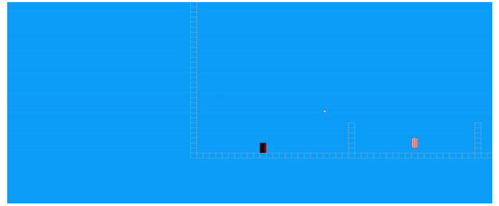
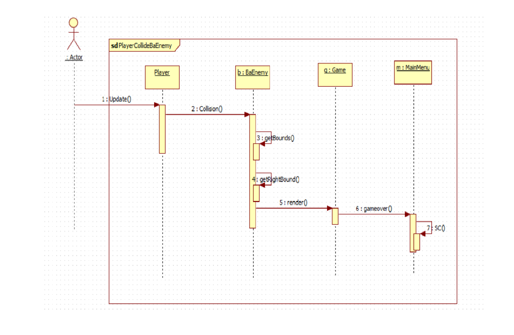
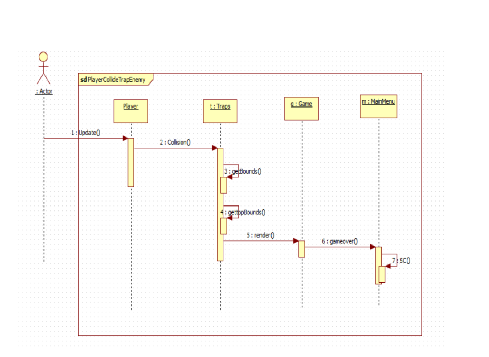

                      Collision Concept/Collision bounds Algorithm:

The collision concept in game physics programming is when two object truly collide with
each other/ overlap each other. In the game, this is shown or attained by using in-
built rectangle class of the Java. The Player object is surrounded by 4 rectangles,
one on its bottom, one on its top, one of left and one of right. Basic Enemy
BaEnemy is covered by 2 rectangle left and right and lastly traps are surrounded
by two rectangles one of top and one on bottom. Particle is made of a whole
rectangle.

We will check if any of these rectangle overlap or collide with each other by using
rectangle class’s intersect which will return true if any of the rectangle is colliding
with the other rectangle.
Here is a gif which shows a prototype model of game where our player is a black
object surrounded by 4 red rectangles on all four side and BaEnemy object on left
and right. They are colliding/intersecting with the particle which is rectangle itself.
Thus, it returns true, which execute the condition or changes the variable in
player class and make it possible for it to move around on the particle rectangle

Below Are some sequence diagram that shows the inner workflow! Makes it easier to understand what is really happening 

Player Colliding with BaEnemy:
In the above sequence diagram we are seeing collision. Here player is colliding
with the Basic enemy or BaEnemy object. Which result in making bool gameover
true which results in Game object making gameover overlay which is inside
render function of it.

Again, like the previous representation of sequence diagram, it is collision
function for the Trap class’s object. If player collides with top or bottom bound of
trap it’ll result in Gamover.

