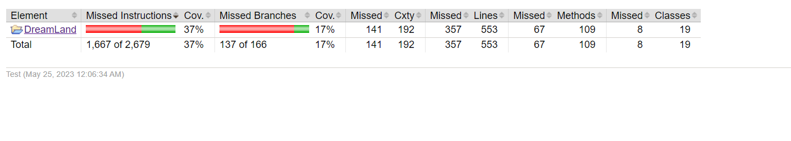
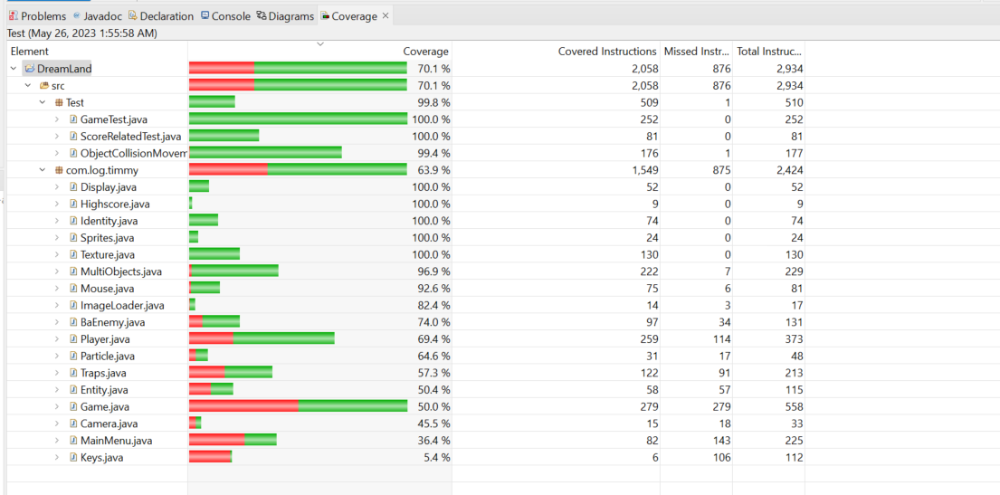

# Coverage Task

Measuring code coverage for tests and extending test suite based on the results (JaCoCo)
Performer: Arlind Bajraktari 

During this task, I focused on improving the coverage results of our project using Jacoco in Eclipse. The initial coverage was around 37%, which indicated that a significant portion of our code was not being adequately tested. To address this, I implemented four additional test cases to enhance the coverage and ensure a more comprehensive testing approach.

By carefully analyzing the codebase and identifying areas with low coverage, I designed and executed the new tests to target those specific sections. These tests aimed to exercise different scenarios and edge cases, ensuring that the critical functionalities of the project were thoroughly tested.

# Description

The diligent effort put into expanding the test suite yielded remarkable results. The coverage percentage increased significantly from 37% to an impressive 70%. This improvement demonstrates the enhanced reliability and robustness of our codebase, as a larger portion of the code is now tested and validated.

Coverage before making changes:

Coverage after changes:

By increasing the coverage, we have gained more confidence in the correctness and effectiveness of our software. It also helps identify potential bugs, vulnerabilities, and areas of improvement early in the development process, leading to higher quality and more maintainable code.

Through this coverage task, we have not only achieved a substantial increase in coverage but also reinforced the importance of comprehensive testing practices. It serves as a reminder to prioritize test coverage as an integral part of our development workflow, ensuring the stability and reliability of our software.

# New test cases

The GameTest class contains a set of JUnit tests for the Game class.

In the startGameTest method, the test verifies the functionality of the start and stop methods of the Game class. It uses reflection to access the private methods and fields of the Game class and checks if the game is working correctly by asserting the value of the working field before and after calling the methods.

The displayTest method tests the Display class by creating an instance of it with specified width, height, and game instance. It then verifies that the window object is not null and checks if the preferred size of the game component matches the specified dimensions.

The testMousePressed method checks the behavior of the Mouse class by simulating mouse clicks in different areas of the game window. It verifies that the idn and scores fields of the Game class are updated correctly based on the mouse click positions.

The testGetBounds method tests the getBounds method of the Particle class. It creates an instance of the Particle class with specific position and dimensions and checks if the returned Rectangle object matches the expected bounds.

These tests help ensure the correct functionality of the Game, Display, Mouse, and Particle classes and contribute to improving the overall test coverage.