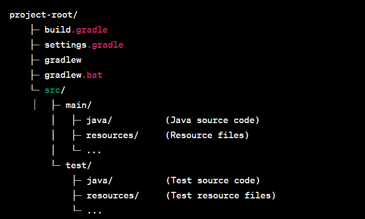

# Building framework

The purpose of a building framework is to provide a structured and organized approach to developing software or applications. A framework is a pre-designed set of 
tools, libraries, and guidelines that help streamline the development process and facilitate efficient and consistent coding practices.

Although there are many building frameworks available but Gradle is most common and widely used now a days. Therefore in this project we used gradle for this purpose.

# Gradle

Gradle is a popular build automation tool and dependency management system used primarily for Java and JVM-based projects. It provides a flexible and efficient way 
to build, test, and deploy software applications. Gradle uses a Groovy-based domain-specific language (DSL) or Kotlin DSL for defining build scripts, making it 
highly customizable and expressive.

## Gradle project structure

A typical gradle project has the following struture:

1. **build.gradle:**
This file is the heart of a Gradle project. It defines the project configuration, dependencies, and various build tasks. You'll typically find the project-specific configurations, such as source sets, dependencies, plugins, and custom tasks defined in this file.

2. **settings.gradle:**
This file defines the project structure and settings. It includes the names and configurations of the subprojects/modules within the project. If your project 
consists of multiple subprojects, you'll list them here.

3. **gradlew and gradlew.bat:**
These are wrapper scripts used for executing Gradle commands. The Gradle Wrapper ensures that the correct version of Gradle is used without requiring developers to install Gradle globally. The script is platform-specific, with **gradlew** for Unix/Linux systems and **gradlew.bat** for Windows.

4. **src/main/:**
This directory contains the main source code and resources for your project. The **java/** directory typically holds your Java or Kotlin source files, while the 
**resources/** directory stores resource files like configuration files, images, or XML files.

5. **src/test/:**
This directory contains the test-related source code and resources. Similar to **src/main/**, the **java/** directory holds test source code, and the **resources/** directory stores test-specific resources.

